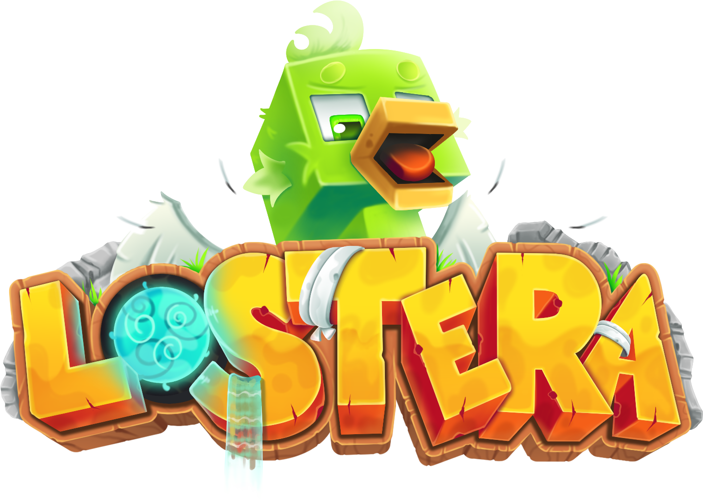

# Introduction

<figure><figcaption></figcaption></figure>

**LostEra** est un serveur Minecraft **Gens Tycoon** francophone, lancé en septembre 2024. 1er serveur à avoir importé le mode de jeu Gens Tycoon sur le sol français, LostEra propose une expérience économique basée sur l'évolution des générateurs (gens), le farm optimisé et une progression compétitive.

Ce wiki documente le mode **Gens Tycoon** de LostEra : vous trouverez ici toutes les informations nécessaires pour comprendre le serveur, progresser efficacement et profiter au maximum de votre aventure.


Ce wiki est en cours de rédaction et sera complété au fur et à mesure de l'ajout de nouvelles fonctionnalités sur le serveur.


## 3 types de gameplay

Êtes-vous plutôt fermier, mineur ou pêcheur dans l'âme ? Sur LostEra, votre outil s'adapte à votre style de jeu ! Améliorez vos enchantements, équipez des boosts et devenez le leader de l'économie.

## De quoi parle ce wiki ?

LostEra est un serveur orienté **progression** : vous développez votre île, vous montez en puissance via le minage, le farming et la pêche, et vous améliorez votre économie grâce au shop, aux caisses et à l'hôtel des ventes.

Ce wiki couvre actuellement :

* 🚀 [Démarrage rapide](bienvenue/demarrage-rapide.md) — Comment bien débuter sur le serveur
* 💰 [Économie & Shop](economie-and-shop/monnaies-et-shop.md) — Monnaies, Shop, Caisses, LootBoxes, Hôtel des Ventes
* 🏅 [Rangs & Permissions](grades/rangs-et-permissions.md) — Les grades achetables et leurs avantages
* 🏝️ [Skyblock & Îles](skyblock-and-iles/les-iles.md) — Création et gestion de votre île
* ⚙️ [Progression & Gens](progression-and-gens/generateurs.md) — Générateurs, Multi-Outil, Armures, Totems, Passe de Combat
* 🐉 [Pets & Cosmétiques](pets-and-cosmetiques/les-dragons.md) — Dragons et personnalisation esthétique

## Rejoindre le serveur

|                     |                                                                  |
| ------------------- | ---------------------------------------------------------------- |
| **IP de connexion** | `play.lostera.fr`                                                |
| **Version**         | 1.21.8 conseillée                                                |
| **Discord**         | [discord.com/invite/lostera](https://discord.com/invite/lostera) |
